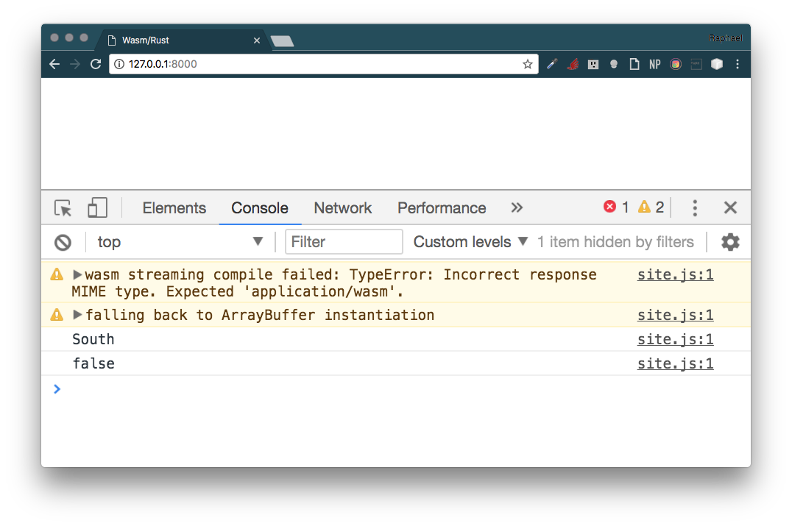
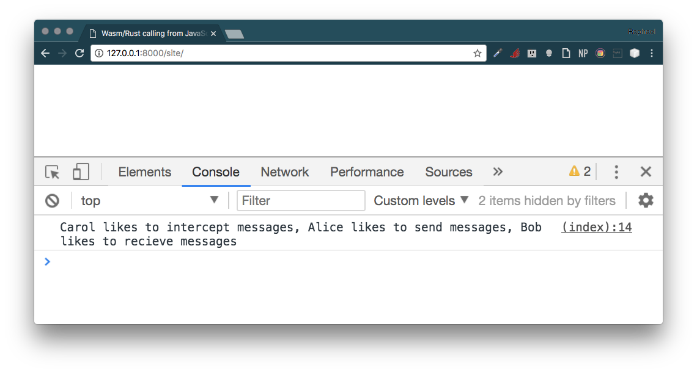

<h1 align="center">WebAssembly and Rust</h1>
<h3 align="center">~ A Web Love Story ~</h3>

<p align="center">
  
  
  
</p>


## Before Start

- Basic knowledge of HTML and JavaScript
- Enthusiasm for going fast on the web
- Your favourite browser that supports Web Assembly

You can check out `about:config` (Firefox) or `chrome://flags/` (Chrome) and make sure `wasm` related things are enabled.

## WebAssembly (WASM)

WebAssembly or WASM is a low-level bytecode format for in-browser client-side scripting, evolved from JavaScript. Its initial aim is to support compilation from C and C++, though other source languages such as [Rust](https://www.rust-lang.org/en-US/) are also supported.

Initial implementation of WebAssembly support in browsers will be based on the featureset of [asm.js](http://asmjs.org/).

The asm.js is an intermediate programming language designed to allow computer software written in languages such as C to be run as web applications while maintaining performance characteristics considerably better than standard JavaScript, the typical language used for such applications. Consists of a strict subset of JavaScript, into which code written in statically-typed languages with manual memory management (such as C) is translated by a source-to-source compiler such as Emscripten (based on LLVM).

Performance is improved by limiting language features to those amenable to ahead-of-time optimization and other performance improvements.

#### Code generation based on asm.js

Calculate the length of a string in C:

```c
size_t strlen(char *ptr) {
  char *curr = ptr;
  while (*curr != 0) {
    curr++;
  }
  return (curr - ptr);
}
```

Would output the following JS code:

```js
function strlen(ptr) {
  ptr = ptr|0;
  var curr = 0;
  curr = ptr;
  while (MEM8[curr]|0 != 0) {
    curr = (curr + 1)|0;
  }
  return (curr - ptr)|0;
}
```

**Note:** Much of performance gain over normal JavaScript is due to 100% type consistency and virtually no garbage collection (memory is manually managed in a large typed array).

In March 2017, the WebAssembly Community Group reached consensus on the initial (MVP) binary format, JavaScript API, and reference interpreter. It defines a WebAssembly binary format.

See the representation of 3 different views of the same source code:

#### C (Input Source)

```c
int factorial(int n) {
  if (n == 0)
    return 1;
  else
    return n * factorial(n-1);
}
```

#### Linear Assembly Bytecode ([IR](https://en.wikipedia.org/wiki/Intermediate_representation))

Data structure used internally by wasm compiler to represent source code.

```
get_local 0
i64.eqz
if i64
    i64.const 1
else
    get_local 0
    get_local 0
    i64.const 1
    i64.sub
    call 0
    i64.mul
end
```

#### WASM binary encoding

In hexadecimal:

```
20 00
50
04 7E
42 01
05
20 00
20 00
42 01
7D
10 00
7E
0B
```

The WASM compiler system internally uses [s-expressions](https://en.wikipedia.org/wiki/S-expression) - notation for nested list (tree-structured) data, invented for and popularized by the programming language [Lisp](https://en.wikipedia.org/wiki/Lisp_(programming_language)), which uses them for source code as well as data - for parsing simplicity as well to handle intermediate code.

An example is shown below:

```lisp
(module
  (type $FUNCSIG$dd (func (param f64) (result f64)))
  (import "global.Math" "exp" (func $exp (param f64) (result f64)))
  (memory 256 256)
  (export "memory" (memory 0))
  (func $doubleExp (param $0 f64) (result f64)
    (f64.mul
      (call $exp
        (get_local $0)
      )
      (f64.const 2)
    )
  )
  (export "doubleExp" (func $doubleExp))
)
```

#### Emscripten

Emscripten is an LLVM-based project that compiles C and C++ into highly-optimizable JavaScript in asm.js format. This lets you run C and C++ on the web at near-native speed, without plugins.

Thanks to LLVM, Emscripten and asm.js, code runs at near-native speed.

## Rust Language

Rust is a systems programming language sponsored by Mozilla Research, which describes it as a "safe, concurrent, practical language," supporting functional and imperative-procedural paradigms. Rust is syntactically similar to C++, but its designers intend it to provide better memory safety while maintaining performance.

Rust is an open source programming language. Its designers have refined the language through the experiences of writing the Servo web browser layout engine and the Rust compiler.

Featuring: zero-cost abstractions, move semantics, guaranteed memory safety, threads without data races, trait-based generics, pattern matching, type inference, minimal runtime and efficient C bindings.

Some code in Rust:

```rust
fn main() {
    let greetings = ["Hello", "Hola", "Bonjour",
                     "Ciao", "こんにちは", "안녕하세요",
                     "Cześć", "Olá", "Здравствуйте",
                     "Chào bạn", "您好", "Hallo",
                     "Hej"];

    for (num, greeting) in greetings.iter().enumerate() {
        print!("{} : ", greeting);
        match num {
            0 =>  println!("This code is editable and runnable!"),
            1 =>  println!("¡Este código es editable y ejecutable!"),
            2 =>  println!("Ce code est modifiable et exécutable !"),
            3 =>  println!("Questo codice è modificabile ed eseguibile!"),
            4 =>  println!("このコードは編集して実行出来ます！"),
            5 =>  println!("여기에서 코드를 수정하고 실행할 수 있습니다!"),
            6 =>  println!("Ten kod można edytować oraz uruchomić!"),
            7 =>  println!("Este código é editável e executável!"),
            8 =>  println!("Этот код можно отредактировать и запустить!"),
            9 =>  println!("Bạn có thể edit và run code trực tiếp!"),
            10 => println!("这段代码是可以编辑并且能够运行的！"),
            11 => println!("Dieser Code kann bearbeitet und ausgeführt werden!"),
            12 => println!("Den här koden kan redigeras och köras!"),
            _ =>  {},
        }
    }
}
```

Other code written in Rust (example of [Array and Slices](https://doc.rust-lang.org/stable/rust-by-example/primitives/array.html)):

```rust
use std::mem;

// This function borrows a slice
fn analyze_slice(slice: &[i32]) {
    println!("first element of the slice: {}", slice[0]);
    println!("the slice has {} elements", slice.len());
}

fn main() {
    // Fixed-size array (type signature is superfluous)
    let xs: [i32; 5] = [1, 2, 3, 4, 5];

    // All elements can be initialized to the same value
    let ys: [i32; 500] = [0; 500];

    // Indexing starts at 0
    println!("first element of the array: {}", xs[0]);
    println!("second element of the array: {}", xs[1]);

    // `len` returns the size of the array
    println!("array size: {}", xs.len());

    // Arrays are stack allocated
    println!("array occupies {} bytes", mem::size_of_val(&xs));

    // Arrays can be automatically borrowed as slices
    println!("borrow the whole array as a slice");
    analyze_slice(&xs);

    // Slices can point to a section of an array
    println!("borrow a section of the array as a slice");
    analyze_slice(&ys[1 .. 4]);

    // Out of bound indexing yields a panic
    println!("{}", xs[5]);
}
```

If're not familiar with almost none of this code. I extremally recommend you to stop few minutes on [Rust by Example](https://doc.rust-lang.org/stable/rust-by-example/hello.html).

## Why it Right Now?

JavaScript was created in 1995. It wasn’t designed to be fast, and for the first decade, it wasn’t fast. Then the browsers started getting more competitive.

In 2008, a period that people call the performance wars began. Multiple browsers added just-in-time compilers, also called JITs. As JavaScript was running, the JIT could see patterns and make the code run faster based on those patterns.

The introduction of these JITs led to an inflection point in the performance of JavaScript. Execution of JS was 10x faster.

With this improved performance, JavaScript started being used for things no one ever expected it to be used for, like server-side programming with Node.js. **The performance improvement made it feasible to use JavaScript on a whole new class of problems**.

We may be at another one of those inflection points now, with WebAssembly.

- Retired from "[A Cartoon Intro To Webassembly, Lin Clark](https://hacks.mozilla.org/2017/02/a-cartoon-intro-to-webassembly/)"

## Installing

1. Setup rustp

Rustup is an official Rust project that allows us to install, manage, and update multiple Rust toolchains.

```shell
curl https://sh.rustup.rs -sSf | sh
```

After we’ll be prompted to run the following command to update the current shell with the changes:

```shell
source $HOME/.cargo/env
```

Add the wasm32-unknown-emscripten compile target via rustup as well:

```shell
rustup target add wasm32-unknown-emscripten
```

Set up Emscripten via emsdk. We’ll use the incoming version of Emscripten in order to get the best output.

```shell
curl https://s3.amazonaws.com/mozilla-games/emscripten/releases/emsdk-portable.tar.gz | tar -zxv -C ~/
cd ~/emsdk-portable
./emsdk update
./emsdk install sdk-incoming-64bit
./emsdk activate sdk-incoming-64bit
```

Emscripten is installed.

The last command will instruct us how to add the binaries to our path for permanent usage, or we can just source `./emsdk_env.sh` for temporary fun.

```shell
$ emcc -v
emcc (Emscripten gcc/clang-like replacement + linker emulating GNU ld) 1.37.22
clang version 4.0.0 (https://github.com/kripken/emscripten-fastcomp-clang.git 3659f873b523e5fc89ffa16baab8901fbd084251) (https://github.com/kripken/emscripten-fastcomp.git de9659961c692174fc4651a6ea0720236e4c4739) (emscripten 1.37.22 : 1.37.22)
Target: x86_64-apple-darwin17.2.0
Thread model: posix
InstalledDir: /Users/raphael.amorim/emsdk-portable/clang/fastcomp/build_incoming_64/bin
INFO:root:(Emscripten: Running sanity checks)
```

Let’s create the project.

```
cargo init wasm-demo --bin && rustup override set nightly
```

Put our first code sample into `src/main.rs`:

```rust
#[derive(Debug)]
enum Direction { North, South, East, West }

fn is_north(dir: Direction) -> bool {
    match dir {
        Direction::North => true,
        _ => false,
    }
}

fn main() {
    let points = Direction::South;
    println!("{:?}", points);
    let compass = is_north(points);
    println!("{}", compass);
}
```

Run it to see what happens:

```shell
$ cargo run
   Compiling wasm-rust v0.1.0 (file:///Users/raphael.amorim/Documents/gcom/webassembly-and-rust/examples/wasm-rust)
   Finished dev [unoptimized + debuginfo] target(s) in 0.66 secs
   Running `target/debug/wasm-rust`
South
false
```

Let's build for browsers:

```shell
cargo build --target=wasm32-unknown-emscripten --release
```

Run `tree` on target folder:

```shell
$ tree target
target
├── debug
│   ├── build
│   ├── deps
│   │   ├── wasm_rust-34c6ef5f29bee9df
│   │   └── wasm_rust-34c6ef5f29bee9df.dSYM
│   │       └── Contents
│   │           ├── Info.plist
│   │           └── Resources
│   │               └── DWARF
│   │                   └── wasm_rust-34c6ef5f29bee9df
│   ├── examples
│   ├── incremental
│   ├── native
│   ├── wasm-rust
│   ├── wasm-rust.d
│   └── wasm-rust.dSYM -> /Users/raphael.amorim/Documents/gcom/webassembly-and-rust/examples/wasm-rust/target/debug/deps/wasm_rust-34c6ef5f29bee9df.dSYM
├── release
│   ├── build
│   ├── deps
│   ├── examples
│   ├── incremental
│   └── native
└── wasm32-unknown-emscripten
    └── release
        ├── build
        ├── deps
        │   ├── wasm-rust.js
        │   └── wasm_rust.wasm
        ├── examples
        ├── incremental
        ├── native
        ├── wasm-rust.d
        ├── wasm-rust.js
        ├── wasm_rust.d
        └── wasm_rust.wasm
```

cargo created several files in `target/wasm32-unknown-emscripten/release/deps/` for us. Of primary interest are the `.wasm` and `.js` files.

Why do we get both a `wasm` and a `js`? Wasn’t the whole point of this to not use Javascript? Turns out we need some Javascript glue code to fetch, initialize, and configure it.

Create a `site/index.html` with the following content:

```html
<!DOCTYPE html>
<html lang="en">
<head>
  <meta charset="UTF-8">
  <title>Wasm/Rust</title>
  <script>
    // This is read and used by `site.js`
    var Module = {
      wasmBinaryFile: "wasm_demo.wasm"
    }
  </script>
  <script src="site.js"></script>
</head>
<body></body>
</html>
```

Let's automatize it with `Makefile`, set up some way to get the generated files from the `target/` folder into the `site/` folder (* use `tabs`):

```Makefile
SHELL := /bin/bash

all:
  cargo build --target=wasm32-unknown-emscripten --release
  mkdir -p site
  find target/wasm32-unknown-emscripten/release/deps -type f -name "*.wasm" | xargs -I {} cp {} site/wasm_demo.wasm
  find target/wasm32-unknown-emscripten/release/deps -type f ! -name "*.asm.js" -name "*.js" | xargs -I {} cp {} site/site.js
```

Run `make` and see the tree:

```shell
$ tree site
site
├── index.html
├── site.js
└── wasm_demo.wasm
```

Let’s test our generated code by running `python -m SimpleHTTPServer`, browsing to `http://localhost:8000/site/`, and opening the browser console.



## Wasm and Rust Called from Javascript

[Link to example](examples/wasm-rust-calling-from-js)

**src/main.rs**

```rust
use std::os::raw::c_char;
use std::ffi::CString;
use std::collections::HashMap;

#[no_mangle]
pub fn get_data() -> *mut c_char {
    let mut data = HashMap::new();
    data.insert("Alice", "send");
    data.insert("Bob", "recieve");
    data.insert("Carol", "intercept");

    let descriptions = data.iter()
        .map(|(p,a)| format!("{} likes to {} messages", p, a))
        .collect::<Vec<_>>();

    CString::new(descriptions.join(", "))
        .unwrap()
        .into_raw()
}

fn main() {
    // Deliberately blank.
}
```

In Client-side:

```javascript
var Module = {
  wasmBinaryFile: "site.wasm",
  onRuntimeInitialized: main,
};
function main() {
  var getData = Module.cwrap('get_data', 'string', []);
  console.log(getData());
};
```



## Credits

Thanks to [hoverbear](http://hoverbear.org) by examples and Rust/Wasm setup guide.

## References

- https://en.wikipedia.org/wiki/WebAssembly
- https://en.wikipedia.org/wiki/Rust_(programming_language)
- https://hoverbear.org/2017/04/06/the-path-to-rust-on-the-web/
- http://cultureofdevelopment.com/blog/build-your-first-thing-with-web-assembly/
- https://github.com/mbasso/awesome-wasm
- https://hacks.mozilla.org/2017/02/a-cartoon-intro-to-webassembly/
- https://codelabs.developers.google.com/codelabs/web-assembly-intro/index.html?index=..%2F..%2Findex#0
- https://github.com/mrfr0g/rust-webassembly
- https://internals.rust-lang.org/t/state-of-webassembly-and-rust/6077
- https://www.rust-lang.org/en-US/
- https://hacks.mozilla.org/2017/02/a-crash-course-in-assembly/
- https://www.hellorust.com/emscripten/slides/rbr-talk/
- https://hoverbear.org/2017/03/03/setting-up-a-rust-devenv/#setting-up-rust-via-rustup
S
